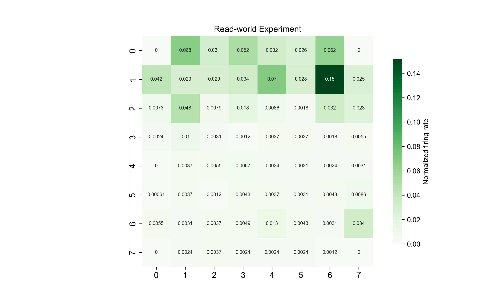
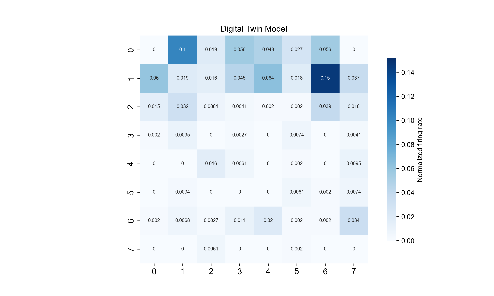
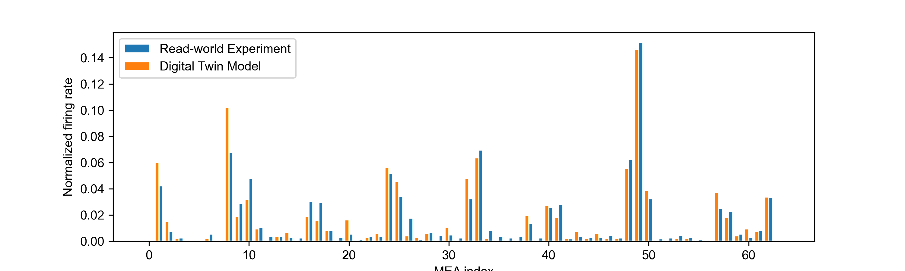

## Virtual-INTM
* The UI design of this project is based on Tkinter / [ttkbootstrap][1]
* The core module of this project is based on [brainpy][2]


### Packaging
* Make sure you have the correct python environment
* Execute instructions
```shell
Pyinstaller -F pysim.py   				# or
Pyinstaller -F -w pysim.py 				# Packaging without console
Pyinstaller -F -w -i XXX.ico pysim.py 	# Pack and specify exe icon packaging
```

### Quick Use

run `pysim.exe`:

* On the initial screen, enter the MEA size (default 8 x 8)

<div align="center">
	
</div>

* We can get the following main interface:
<div align="center">
	
</div>

* Digital Twin Model:
    * Clik `Digital Twin Model` and choose `data/2.1.1/2.1.1.mat`
    * Clik `Preset` and choose `data/2.1.1/args.yaml`
    * Click the `Run` button at the top of the interface
    * We can get the results in `logs/outputs`:
<div align="center">
	 
    
</div> 


### Introduction

The simulator page mainly includes 6 components:

* Mode selection: including **Digital Twin Model** and **Virtual Experiment**
    * **Digital Twin Model**: Fitting digital twin models with real biological data
        > `Preset`: load existing parameters (`.yaml` file)  
    * **Virtual Experiment**: Use existing digital twin models to conduct different virtual experiments
        > `Comp`: Load real data to compare with virtual experiments (`.mat` file) 

* Build stimulation paradigm: control which electrode emit stimulation
    > `load`: Loading an existing MEA stimulation format (`.txt` file)
    > `clear`: Clear the existing stimulation paradigm

* Core parameters (must be selected): select neuron type, synapse type, long-term plasticity model
* Run parameters
* Topology
* Other parameters


### Note 

* Limited by `brainpy` and `jax`, only `cpu` can be used;
    Because of the use of `cpu`, the speed is slow and takes about 1~2 minutes;

* Due to jax, the packaging fails. Here is a simple code comment of the problem
https://github.com/google/jax/issues/17705 `File "jax\_src\interpreters\mlir.py", line 711, in lower_jaxpr_to_module jaxlib.mlir._mlir_libs._site_initialize.<locals>.MLIRError: Verification failed`

* As the number of neurons and synapses increases, more randomness is created; excellent results require more attempts under the same parameters

* Each data directory contains three files:
    * `.mat` raw pulse data file
    * `.txt` stimulation paradigm file, 8x8; can be loaded with the UI interface load tool
    * `.yaml` parameter configuration file, containing a set of fine-tuned parameters; can be loaded with the UI interface Preset tool
    * `.pkl` topology organization file, mainly used for simulation
    * `outputs` stores related simulation results


[1]: https://ttkbootstrap.readthedocs.io/en/latest/zh/ " ttkbootstrap"
[2]: https://github.com/brainpy/BrainPy "BrainPy(Github)"
