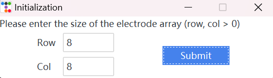
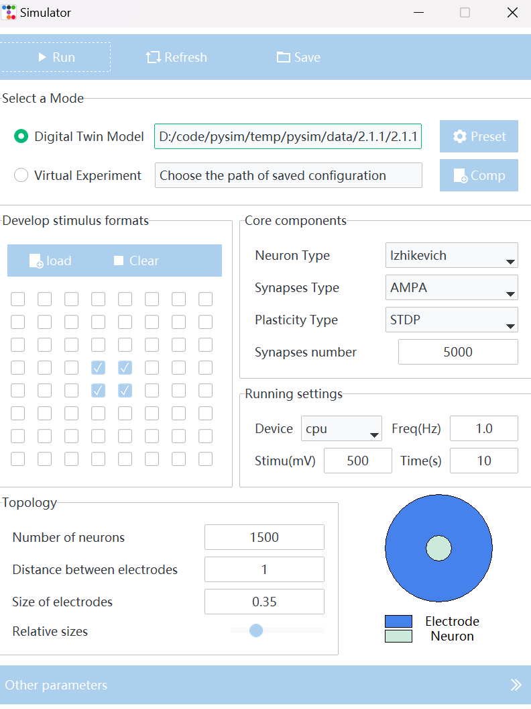
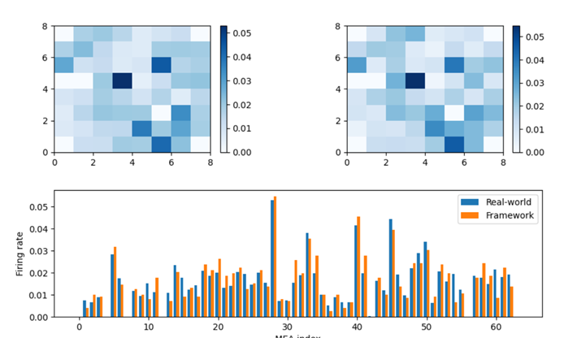
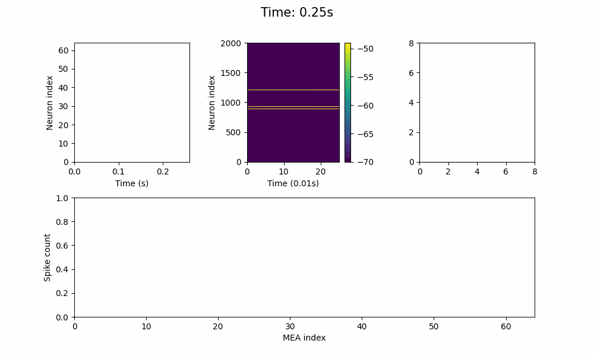

## Pysim

本项目UI设计基于Tkinter/  [ttkbootstrap][1]

本项目核心模块基于 [brainpy][2] ,更多信息详见原仓库

### 打包

执行指令

```shell
Pyinstaller -F pysim.py   				# 打包exe
Pyinstaller -F -w pysim.py 				# 不带控制台的打包
Pyinstaller -F -w -i XXX.ico pysim.py 	# 打包指定exe图标打包
```

### 使用

执行 `pysim.exe` ：

* 进入初始界面，输入MEA尺寸（默认8 x 8​​ ）

  <details>
  <summary>初始界面</summary>
  
  </details>

* 提交后进入主界面；点击 `Select a Mode` / `Simulation`，选择 `egs/`文件夹，点击运行即可

  
  
* 结果：

  * 拟合结果

    
  
  * 模拟结果
  
  


### 介绍

模拟器页面主要包括6个组件：

* 模式选择：包括**拟合**真实数据 (fitting)  和  模拟 (simulation)
* 构建刺激范式：控制哪些MEA发放刺激
* 核心参数（必须选择）：选择神经元类型、突触类型、长期可塑性模型
* 运行参数
* 拓扑结构
* 其他参数

### Note 

* 受`brainpy`和`jax`限制，目前只能用`cpu`；
  由于使用`cpu`，因此速度较慢，需要1~2分钟左右；后续增加等待时间进度条
* 由于jax原因，导致打包出现失败，这里简单将出现问题的代码注释
  https://github.com/google/jax/issues/17705
   `File "jax\_src\interpreters\mlir.py", line 711, in lower_jaxpr_to_module
  jaxlib.mlir._mlir_libs._site_initialize.<locals>.MLIRError: Verification failed`

### Todo

[1]: https://ttkbootstrap.readthedocs.io/en/latest/zh/ " ttkbootstrap"
[2]: https://github.com/brainpy/BrainPy "BrainPy(Github)"
